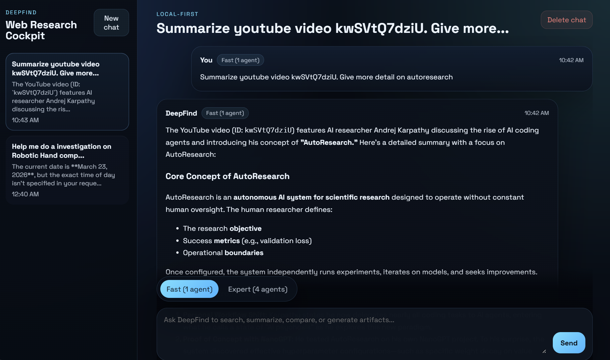

# deepfind-cli

A multi-agent research tool in both Web App and CLI, which can:

- Search (no limit) in Google / Baidu / Xiaohongshu via opencli
- Search BOSS Zhipin jobs via opencli
- Follow up on BOSS Zhipin job chats via opencli
- Watch video in Bilibili / YouTube and summarize via opencli
- Customize any other cli as agent tool


## Web App Usage





## CLI Usage


```
uv run -m deepfind.cli "Help me do a research on Robotic Hands, give me a TLDR table" --num-agent 1

uv run -m deepfind.cli "Help me summarize nVidia press conference https://www.bilibili.com/video/BV1EhwmzsEqB - What's new?" --num-agent 1

uv run -m deepfind.cli "Help me summarize https://www.bilibili.com/video/BV1tew5zVEDf What Saining Xie point of view in the interview" --num-agent 1 --quiet

uv run -m deepfind.cli "Help me summarize this YouTube talk https://www.youtube.com/watch?v=dQw4w9WgXcQ" --num-agent 1

uv run -m deepfind.cli "How people think Elon Musk in Xiaohongshu?" --num-agent 2

uv run -m deepfind.cli "Help me search Agent jobs on Boss" --num-agent 1

uv run -m deepfind.cli "help me survey robotics arms industry" --num-agent 3 --long-report-mode --once

uv run -m deepfind.cli --list-tools
```


## Install

Install everything needed for local GPU mode, browser fetch, and Bilibili ASR in one setup step:

```bash
uv sync --extra media --extra browser --extra local-llm --extra-index-url https://mirrors.aliyun.com/pytorch-wheels/torch_stable.html
```

Install `opencli` for web search and video download:

```bash
npm install -g @jackwener/opencli
```

Install Playwright for `browser_fetch` (renders pages in a real Chrome to handle JS/cookies):

```bash
uv sync --extra browser
playwright install
```

When a site still shows a verification page in `browser_fetch`, retry with `headless=false`.
Deepfind keeps a persistent browser profile under `tmp/browser_profile`, so if you manually pass login/captcha once, later fetches can often reuse that session.

Pre-download the ASR model on Windows (PowerShell) to avoid first-run delay:

```bash
hf download Qwen/Qwen3-ASR-1.7B --repo-type model
```

```bash
uv tool install bilibili-cli
uv tool install xiaohongshu-cli
uv tool install twitter-cli
bili whoami
xhs whoami
twitter whoami
```

## Env

The CLI auto-loads `.env` from the repo root.

```bash
cp .env.example .env
```

Minimal `.env`:

```bash
QWEN_API_KEY=...
QWEN_MODEL_NAME=qwen3-max
```

Local Ollama GPU mode:

```bash
DEEPFIND_LOCAL_BASE_URL=http://127.0.0.1:11434/v1
DEEPFIND_LOCAL_MODEL=qwen3.5:9b
DEEPFIND_LOCAL_API_KEY=ollama
```

Optional:

```bash
QWEN_BASE_URL=https://dashscope.aliyuncs.com/compatible-mode/v1
DEEPFIND_LOCAL_MODEL=Qwen/Qwen2.5-7B-Instruct
DEEPFIND_LOCAL_QUANTIZATION=4bit
OPENCLI_BIN=opencli
TWITTER_CLI_BIN=twitter
XHS_CLI_BIN=xhs
BILI_BIN=bili
ASR_MODEL=Qwen/Qwen3-ASR-1.7B
DEEPFIND_AUDIO_DIR=audio
DEEPFIND_TOOL_TIMEOUT=90
GOOGLE_NANO_BANANA_API_KEY=...
GOOGLE_NANO_BANANA_MODEL=gemini-3.1-flash-image-preview
DEEPFIND_IMAGE_DIR=tmp
DEEPFIND_IMAGE_SIZE=2K
```

## Run

```bash
uv run -m deepfind.cli "What's new in Xiaohongshu?" --num-agent 2
uv run -m deepfind.cli "Help me summarize video https://www.bilibili.com/video/BV1tew5zVEDf" --num-agent 1
uv run -m deepfind.cli "Help me summarize video https://www.youtube.com/watch?v=dQw4w9WgXcQ" --num-agent 1
uv run -m deepfind.cli "same query" --num-agent 2 --quiet
uv run -m deepfind.cli "same query" 
```

Flags:

- `query`: required unless using `--list-tools`
- `--num-agent`: `1..4`
- `--max-iter-per-agent`: default `50`
- `--quiet`: disable formatted progress output
- `--once`: always exit after the first answer
- `--json`: print structured research JSON
- `--long-report-mode`: switch the final lead response from a concise overview to a long-form report
- `--list-tools`: print built-in tool names/descriptions and exit
- `--gpu`: use the local Ollama model configured by `DEEPFIND_LOCAL_BASE_URL` and `DEEPFIND_LOCAL_MODEL`

To run with Ollama locally:

```bash
ollama serve
ollama pull qwen3.5:9b
uv run -m deepfind.cli "same query" --gpu
```

`--long-report-mode` is explicit only. It does not auto-detect benchmark tasks, so turn it on when you want a long-form benchmark-style report.

## Chat Mode

When `deepfind` runs in a real terminal, it now stays open after the first answer so
you can continue the conversation with the same multi-agent/tool setup.

```bash
uv run -m deepfind.cli "first question"
```

Follow-up commands:

- Press `Enter` on a blank line to skip it.
- Type `exit` or `quit` to leave the session.
- Use `--once` to force the old one-shot behavior.
- If `GOOGLE_NANO_BANANA_API_KEY` is set, you can ask for an image after a summary and it will be saved under `tmp/`.
- You can also ask for one or more standalone HTML slides after a summary and they will be saved under `tmp/`.

```bash
uv run -m deepfind.cli "first question" --once
```

Example follow-up in chat mode:

```text
Generate a 16:9 cover image from that summary and save it under tmp/
Generate 3 HTML slides from that summary and save them under tmp/
```

## Web App

The repo also includes a local web chat UI under [`web/`](./web) with saved chats,
live run activity, an iPhone-friendly mobile drawer, and a mode switch for
`Fast (1 agent)` and `Expert (4 agents)`. When a compatible NVIDIA GPU are available, the composer also shows a GPU/Cloud mode toogle.

Backend:
```bash
uv run deepfind-web --reload
```

Frontend:

```bash
cd web
npm install
npm run dev
```

Open the Vite URL during development, or run `npm run build` so `deepfind-web` can
serve `web/dist` directly.

The production shell now includes a web manifest, touch icon, and iPhone Safari
safe-area handling so it works cleanly in Safari and when added to the Home
Screen.

## Deploy To Raspberry Pi

The repo includes deployment scripts for a Raspberry Pi 5 running Ubuntu at
`david@192.168.0.205`.

One-time SSH key bootstrap from your local machine:

```bash
./scripts/bootstrap_rpi_ssh_key.sh
```

Notes:

- The bootstrap script is now key-only. It verifies passwordless SSH access and, if access is missing, tells you which public key to install on the Pi.
- It uses your existing `~/.ssh/id_ed25519.pub` or `~/.ssh/id_rsa.pub` by default.
- Override `PUBKEY_PATH`, `RPI_HOST`, `RPI_USER`, or `RPI_SSH_PORT` if needed.

Deploy the app after SSH keys are working:

```bash
./scripts/deploy_rpi.sh
```

What the deploy script does:

- Syncs the repo to `/home/david/apps/deepfind-cli`
- Copies the local `.env` file to the Pi
- Installs `uv` if it is missing
- Runs `uv sync --frozen`, `npm ci`, and `npm run build` on the Pi
- Installs and restarts a user-level `deepfind-web` systemd service with `systemctl --user`

No-password deploy requirements:

- Passwordless SSH to the Pi must already work for `david@<host>`.
- The Pi already needs `python3` 3.11+, `curl`, `tar`, and `systemd`.
- `deploy_rpi.sh` will install a user-local Node.js 20.x automatically when `node`/`npm` are missing or too old.
- `deploy_rpi.sh` will also install `@jackwener/opencli` under the same user so `web_search` works after deploy.
- Boot persistence for the user service requires a one-time admin command on the Pi:

```bash
sudo loginctl enable-linger david
```

Default LAN URL after deployment:

```text
http://192.168.0.205:8000
```

Useful checks on the Pi:

```bash
systemctl --user status deepfind-web
curl http://127.0.0.1:8000/api/health
```

## How It Works

- Lead planner can use tools before task split, usually with a `web_search -> web_fetch` flow on the most promising URLs.
- If a page is blocked or requires JavaScript/cookies, use `browser_fetch` instead of `web_fetch`.
- Sub-agents call local tools such as `web_search`, `web_fetch`, `browser_fetch`, `boss_search`, `boss_detail`, `boss_chatlist`, `boss_send`, `xhs_search_user`, `xhs_user`, `xhs_user_posts`, `xhs_read`, `twitter_search`, `twitter_read`, `bili_transcribe`, `youtube_transcribe`, and `youtube_transcribe_full`.
- Lead synthesis merges worker reports, fills gaps, and can do another `web_search -> web_fetch` (or `browser_fetch`) pass when evidence is weak or conflicting.
- Lead final answer turns the synthesis into the user-facing response, and only uses asset tools for final image/slide requests.

## Video Transcription Tools

`bili_transcribe(bili_id, query)` accepts a Bilibili video URL or `BV...` ID, runs download + ASR if needed,
then returns a query-focused summary. Use `bili_transcribe_full(bili_id)` when you need the full transcript.

`youtube_transcribe(url, query)` downloads YouTube audio via `yt-dlp` + `ffmpeg`, transcribes it with local ASR,
then returns a query-focused summary for the given query.

`youtube_transcribe_full(url)` downloads YouTube audio via `yt-dlp` + `ffmpeg`, transcribes it with local ASR,
and returns the full transcript. The raw transcript is cached under
`audio/transcripts/youtube_audio/<VIDEO_ID>.txt`.

Setup (WSL):

```bash
uv tool install bilibili-cli
uv tool install yt-dlp
bili status
```

Artifacts:

- Bilibili segments: `audio/<BVID>/seg_*`
- Bilibili transcript: `audio/transcripts/<BVID>.txt`
- YouTube audio segments: `audio/youtube/<VIDEO_ID>/seg_*`
- YouTube audio transcript: `audio/transcripts/youtube_audio/<VIDEO_ID>.txt`

## Test

```bash
python3 -m unittest discover -s tests -v
```

## APPENDIX

### Agent Roles

Runtime pipeline for a normal research turn:

1. `lead-plan`
2. `sub-1 .. sub-N`
3. `lead-synthesis`
4. `lead-final`

When a follow-up only asks to reformat the previous answer in chat mode, the app can skip research and run `lead-format` directly.

### Agent Contracts

| Agent | Main task / goal | Tool policy | Output format |
| --- | --- | --- | --- |
| `lead-plan` | Split the latest user request into `N` distinct, evidence-seeking research tasks. It may use the prior conversation for context and can do a light `web_search -> web_fetch` pass before splitting work (use `browser_fetch` when blocked or JS-only). | Tools allowed during planning, but used sparingly. Platform-specific work should stay on matching tools. If the user asks for an image or slides, this stage only plans supporting research, not final asset generation. | JSON array only. Each item is usually a task string, but object items are also accepted when they contain a task-like field such as `task`, `title`, or `summary`. |
| `sub-N` worker | Execute one assigned research task, gather evidence, and report the strongest findings plus open gaps. | Tools allowed. Workers should prefer `web_search -> web_fetch` for broad web research (use `browser_fetch` when blocked or JS-only) and use platform-specific tools for Xiaohongshu, X/Twitter, Bilibili, YouTube, and BOSS Zhipin. They should not call `gen_img` or `gen_slides` unless the assigned task explicitly asks for the final asset. | JSON only: `{"summary":"","claims":[{"text":"","citations":[],"confidence":"medium"}],"gaps":[]}` |
| `lead-synthesis` | Merge worker reports, identify the strongest evidence, resolve or highlight conflicts, and fill missing gaps with tools when needed. | Tools allowed. It can do another `web_search -> web_fetch` (or `browser_fetch`) pass if worker evidence is incomplete or conflicting. | JSON only: `{"overview_md":"","key_points":[{"text":"","citations":[],"confidence":"medium"}],"disagreements":[],"gaps":[],"next_steps":[]}` |
| `lead-final` | Turn synthesis into the user-facing answer for the latest request. | No new research. Tools are reserved only for final asset creation, and only when the user explicitly asked for it: `gen_img` once for an image, `gen_slides` once for slides. | Markdown. Default mode is a concise answer. With `--long-report-mode`, it switches to thesis-like Markdown in the current language and should include `## Conclusion`. The system appends `## Reference` from collected citations. |
| `lead-format` | Reformat the previous assistant answer for a follow-up such as a table, list, translation, rewrite, or shorter/longer version. | No tools and no new research. It must work only from the prior assistant answer plus the latest user request. | Plain Markdown / text in the requested format. If the previous answer does not contain enough detail, it should say so briefly instead of inventing new content. |

### Structured JSON Output

When you run:

```bash
uv run -m deepfind.cli "same query" --json
```

the CLI prints a structured envelope with this shape:

```json
{
  "version": "research.v1",
  "query": "user query",
  "lead": {
    "overview_md": "final markdown answer",
    "key_points": [
      {
        "text": "synthesized finding",
        "citation_ids": ["c1"],
        "confidence": "high"
      }
    ],
    "disagreements": [],
    "next_steps": []
  },
  "agents": [
    {
      "agent_id": "sub-1",
      "task": "assigned task",
      "summary": "worker summary",
      "claims": [
        {
          "text": "worker finding",
          "citation_ids": ["c1"],
          "confidence": "medium"
        }
      ],
      "gaps": []
    }
  ],
  "citations": [
    {
      "id": "r1",
      "dedup_id": "c1",
      "url": "https://example.com/report?utm_source=news",
      "title": "",
      "publisher": "",
      "source_agent": "sub-1",
      "source_section": "claim",
      "source_index": 1
    }
  ],
  "citations_dedup": [
    {
      "id": "c1",
      "canonical_url": "https://example.com/report",
      "url": "https://example.com/report?utm_source=news",
      "title": "",
      "publisher": ""
    }
  ],
  "meta": {
    "num_agents": 2,
    "max_iter_per_agent": 50,
    "generated_at": "2026-04-07T00:00:00Z"
  }
}
```

Notes:

- `citations` stores raw citation occurrences with provenance back to the agent and section that emitted them.
- `citations_dedup` stores canonicalized URLs with tracking parameters removed.
- Worker and synthesis prompts expect exact source URLs in `citations` whenever a claim is backed by a tool result.
- If a worker returns non-JSON text, DeepFind keeps the text as `summary`, leaves `claims` empty, and records `gaps: ["non_json_output"]`.
