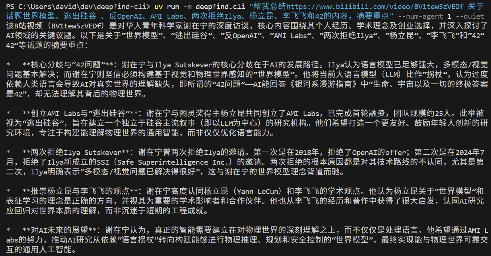
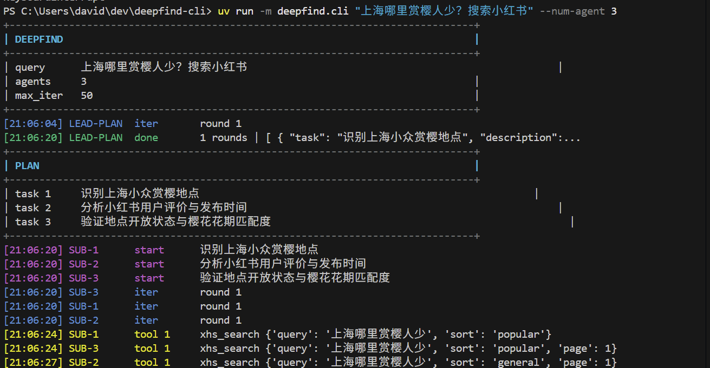

# deepfind-cli

Multi-agent search CLI in Python.

通过 CLI 工具帮你在小红书搜索问题、总结B站视频。




## Usage

```
uv run -m deepfind.cli "帮我总结https://www.bilibili.com/video/BV1tew5zVEDf 关于话题世界模型、逃出硅谷 、反OpenAI、AMI Labs、两次拒绝Ilya、杨立昆、李飞飞和42的内容" --num-agent 1 --quiet

uv run -m deepfind.cli "上海哪里赏樱人少？搜索小红书" --num-agent 2

```
## Install

```bash
python3 -m pip install -e .
```

Install optional ASR dependencies only when you need Bilibili transcription:

```bash
python3 -m pip install -e ".[media]"
```

Pre-download the ASR model on Windows (PowerShell) to avoid first-run delay:

```bash
hf download Qwen/Qwen3-ASR-1.7B --repo-type model
```

```bash
uv tool install bilibili-cli
uv tool install xiaohongshu-cli
uv tool install twitter-cli
bili whoami
xhs whoami
twitter whoami
```

## Env

The CLI auto-loads `.env` from the repo root.

```bash
cp .env.example .env
```

Minimal `.env`:

```bash
QWEN_API_KEY=...
QWEN_MODEL_NAME=qwen3-max
```

Optional:

```bash
QWEN_BASE_URL=https://dashscope.aliyuncs.com/compatible-mode/v1
TWITTER_CLI_BIN=twitter
XHS_CLI_BIN=xhs
BILI_BIN=bili
ASR_MODEL=Qwen/Qwen3-ASR-1.7B
DEEPFIND_AUDIO_DIR=audio
DEEPFIND_TOOL_TIMEOUT=90
```

## Run

```bash
uv run -m deepfind.cli "小红书博主：刘小鸭的AI日记 发过哪些内容？粉丝数?" --num-agent 2
uv run -m deepfind.cli "帮我总结https://www.bilibili.com/video/BV1tew5zVEDf 关于话题世界模型、逃出硅谷、反OpenAI 、AMI Labs、两次拒绝Ilya、杨立昆、李飞飞和42的内容" --num-agent 1
uv run -m deepfind.cli "same query" --num-agent 2 --quiet
uv run -m deepfind.cli "same query" 
```

Flags:

- `query`: required
- `--num-agent`: `1..4`
- `--max-iter-per-agent`: default `50`
- `--quiet`: disable formatted progress output

## How It Works

- Lead agent splits the query into a few tasks.
- Sub-agents call local tools such as `xhs_search_user`, `xhs_user`, `xhs_user_posts`, `xhs_read`, `twitter_search`, `twitter_read`, and `bili_transcribe`.
- Lead agent merges the results into one answer.

Qwen is used through the OpenAI-compatible `chat.completions` API.

## Bilibili Transcription Tool

`bili_transcribe` is available to sub-agents and accepts either a Bilibili video URL
or a raw `BV...` ID.
It returns transcript text only (no summary generation).
If `audio/transcripts/<BVID>.txt` already exists,
the tool reuses it and skips download + ASR transcription.

Setup (WSL):

```bash
uv tool install bilibili-cli
bili status
```

Artifacts:

- Segments: `audio/<BVID>/seg_*`
- Transcript: `audio/transcripts/<BVID>.txt`

## Test

```bash
python3 -m unittest discover -s tests -v
```
