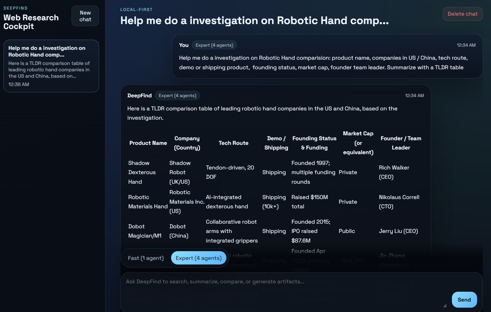
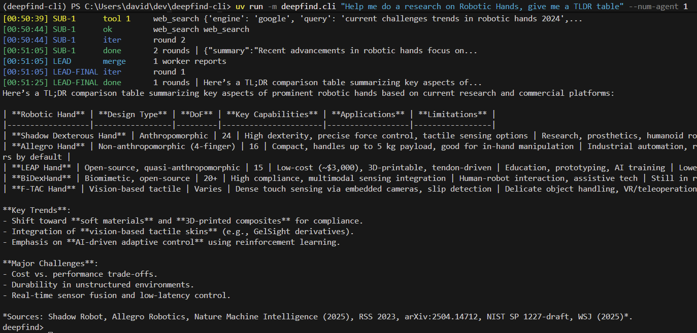

# deepfind-cli

A multi-agent research tool in both Web App and CLI, which can:

- Search (no limit) in Google / Baidu / Xiaohongshu via opencli
- Search BOSS直聘 jobs via opencli
- Watch video in Bilibili and summarize
- Customize any cli as agent tool


## Web App Usage




## CLI Usage



```
uv run -m deepfind.cli "Help me do a research on Robotic Hands, give me a TLDR table" --num-agent 1

uv run -m deepfind.cli "Help me summarize nVidia press conference https://www.bilibili.com/video/BV1EhwmzsEqB - What's new?" --num-agent 1

uv run -m deepfind.cli "Help me summarize https://www.bilibili.com/video/BV1tew5zVEDf What Saining Xie point of view in the interview" --num-agent 1 --quiet

uv run -m deepfind.cli "How people think Elon Musk in Xiaohongshu?" --num-agent 2

uv run -m deepfind.cli "帮我搜索关于 Agent 上海的岗位" --num-agent 1

uv run -m deepfind.cli --list-tools
```


## Install

```bash
python3 -m pip install -e .
```

Install `opencli` as an optional dependency when you want broad web search through
`web_search`:

```bash
npm install -g @jackwener/opencli
```

Install optional ASR dependencies only when you need Bilibili transcription:

```bash
python3 -m pip install -e ".[media]"
```

Pre-download the ASR model on Windows (PowerShell) to avoid first-run delay:

```bash
hf download Qwen/Qwen3-ASR-1.7B --repo-type model
```

```bash
uv tool install bilibili-cli
uv tool install xiaohongshu-cli
uv tool install twitter-cli
bili whoami
xhs whoami
twitter whoami
```

## Env

The CLI auto-loads `.env` from the repo root.

```bash
cp .env.example .env
```

Minimal `.env`:

```bash
QWEN_API_KEY=...
QWEN_MODEL_NAME=qwen3-max
```

Optional:

```bash
QWEN_BASE_URL=https://dashscope.aliyuncs.com/compatible-mode/v1
OPENCLI_BIN=opencli
TWITTER_CLI_BIN=twitter
XHS_CLI_BIN=xhs
BILI_BIN=bili
ASR_MODEL=Qwen/Qwen3-ASR-1.7B
DEEPFIND_AUDIO_DIR=audio
DEEPFIND_TOOL_TIMEOUT=90
GOOGLE_NANO_BANANA_API_KEY=...
GOOGLE_NANO_BANANA_MODEL=gemini-3.1-flash-image-preview
DEEPFIND_IMAGE_DIR=tmp
DEEPFIND_IMAGE_SIZE=2K
```

## Run

```bash
uv run -m deepfind.cli "What's new in Xiaohongshu?" --num-agent 2
uv run -m deepfind.cli "Help me summarize video https://www.bilibili.com/video/BV1tew5zVEDf" --num-agent 1
uv run -m deepfind.cli "same query" --num-agent 2 --quiet
uv run -m deepfind.cli "same query" 
```

Flags:

- `query`: required unless using `--list-tools`
- `--num-agent`: `1..4`
- `--max-iter-per-agent`: default `50`
- `--quiet`: disable formatted progress output
- `--once`: always exit after the first answer
- `--list-tools`: print built-in tool names/descriptions and exit

## Chat Mode

When `deepfind` runs in a real terminal, it now stays open after the first answer so
you can continue the conversation with the same multi-agent/tool setup.

```bash
uv run -m deepfind.cli "first question"
```

Follow-up commands:

- Press `Enter` on a blank line to skip it.
- Type `exit` or `quit` to leave the session.
- Use `--once` to force the old one-shot behavior.
- If `GOOGLE_NANO_BANANA_API_KEY` is set, you can ask for an image after a summary and it will be saved under `tmp/`.
- You can also ask for one or more standalone HTML slides after a summary and they will be saved under `tmp/`.

```bash
uv run -m deepfind.cli "first question" --once
```

Example follow-up in chat mode:

```text
Generate a 16:9 cover image from that summary and save it under tmp/
Generate 3 HTML slides from that summary and save them under tmp/
```

## Web App

The repo also includes a local web chat UI under [`web/`](./web) with saved chats,
live run activity, an iPhone-friendly mobile drawer, and a mode switch for
`Fast (1 agent)` and `Expert (4 agents)`.

Backend:

```bash
uv run deepfind-web --reload
```

Frontend:

```bash
cd web
npm install
npm run dev
```

Open the Vite URL during development, or run `npm run build` so `deepfind-web` can
serve `web/dist` directly.

The production shell now includes a web manifest, touch icon, and iPhone Safari
safe-area handling so it works cleanly in Safari and when added to the Home
Screen.

## Deploy To Raspberry Pi

The repo includes deployment scripts for a Raspberry Pi 5 running Ubuntu at
`david@192.168.0.205`.

One-time SSH key bootstrap from your local machine:

```bash
./scripts/bootstrap_rpi_ssh_key.sh
```

Notes:

- The bootstrap script is now key-only. It verifies passwordless SSH access and, if access is missing, tells you which public key to install on the Pi.
- It uses your existing `~/.ssh/id_ed25519.pub` or `~/.ssh/id_rsa.pub` by default.
- Override `PUBKEY_PATH`, `RPI_HOST`, `RPI_USER`, or `RPI_SSH_PORT` if needed.

Deploy the app after SSH keys are working:

```bash
./scripts/deploy_rpi.sh
```

What the deploy script does:

- Syncs the repo to `/home/david/apps/deepfind-cli`
- Copies the local `.env` file to the Pi
- Installs `uv` if it is missing
- Runs `uv sync --frozen`, `npm ci`, and `npm run build` on the Pi
- Installs and restarts a user-level `deepfind-web` systemd service with `systemctl --user`

No-password deploy requirements:

- Passwordless SSH to the Pi must already work for `david@<host>`.
- The Pi already needs `python3` 3.11+, `node` 18+, `npm`, `curl`, and `systemd`.
- Boot persistence for the user service requires a one-time admin command on the Pi:

```bash
sudo loginctl enable-linger david
```

Default LAN URL after deployment:

```text
http://192.168.0.205:8000
```

Useful checks on the Pi:

```bash
systemctl --user status deepfind-web
curl http://127.0.0.1:8000/api/health
```

## How It Works

- Lead agent splits the query into a few tasks.
- Sub-agents call local tools such as `web_search`, `boss_search`, `boss_detail`, `xhs_search_user`, `xhs_user`, `xhs_user_posts`, `xhs_read`, `twitter_search`, `twitter_read`, and `bili_transcribe`.
- Lead agent merges the results into one answer.

Qwen is used through the OpenAI-compatible `chat.completions` API.

## Bilibili Transcription Tool

`bili_transcribe` is available to sub-agents and accepts either a Bilibili video URL
or a raw `BV...` ID.
It returns transcript text only (no summary generation).
If `audio/transcripts/<BVID>.txt` already exists,
the tool reuses it and skips download + ASR transcription.

Setup (WSL):

```bash
uv tool install bilibili-cli
bili status
```

Artifacts:

- Segments: `audio/<BVID>/seg_*`
- Transcript: `audio/transcripts/<BVID>.txt`

## Test

```bash
python3 -m unittest discover -s tests -v
```
