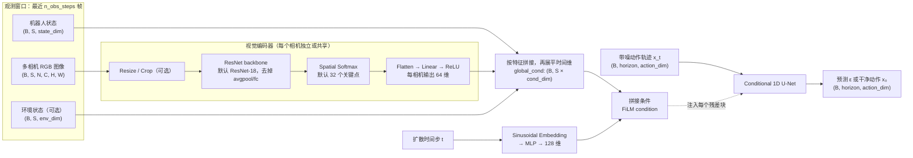
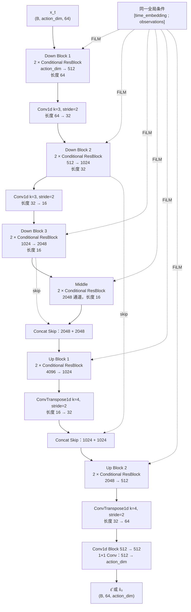
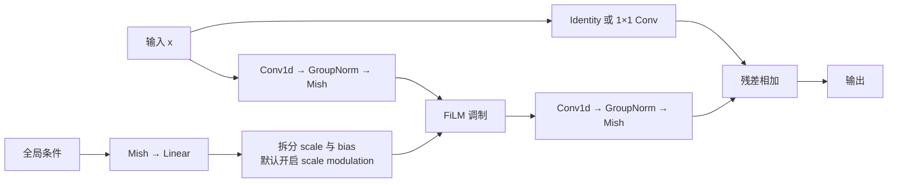
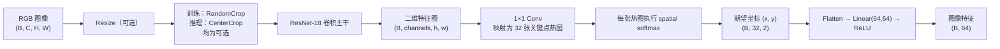
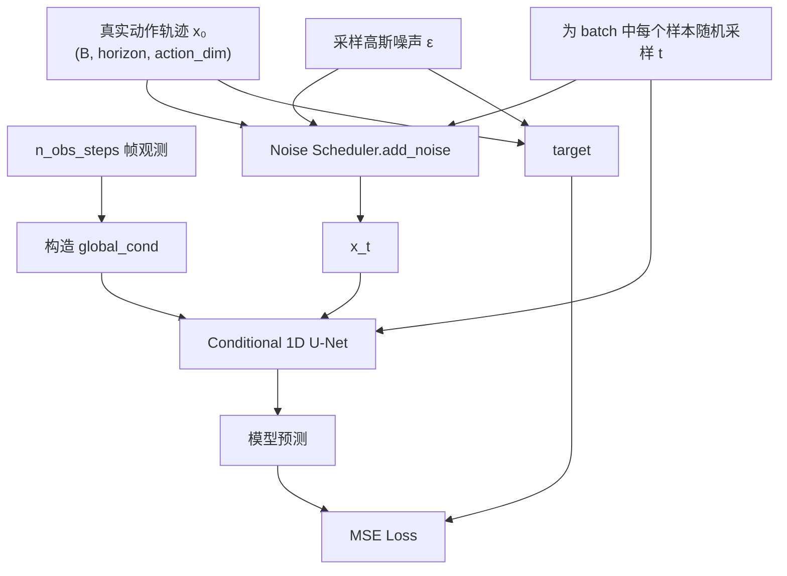
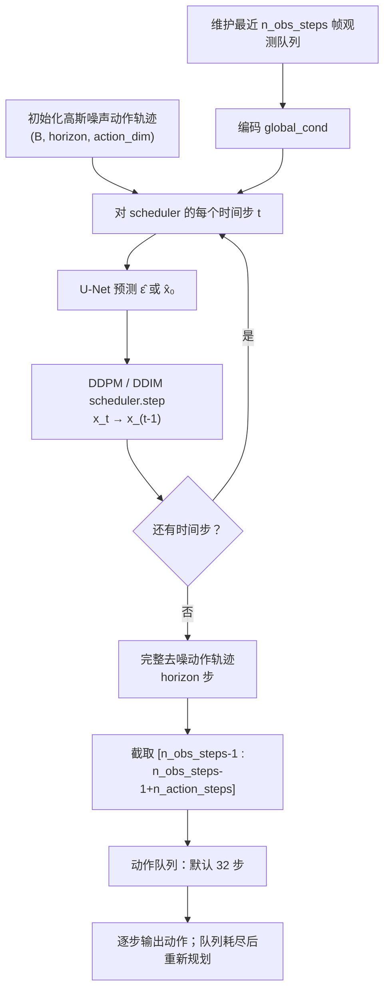

# LeRobot Diffusion Policy 模型架构

> 源码仓库：[huggingface/lerobot](https://github.com/huggingface/lerobot)  
> 主要实现：[modeling_diffusion.py](https://github.com/huggingface/lerobot/blob/9a6bb61043bac8c14353fcb6ea513b7473c118e3/src/lerobot/policies/diffusion/modeling_diffusion.py)  
> 配置定义：[configuration_diffusion.py](https://github.com/huggingface/lerobot/blob/9a6bb61043bac8c14353fcb6ea513b7473c118e3/src/lerobot/policies/diffusion/configuration_diffusion.py)  
> 本文基于上述提交中的 LeRobot 实现整理。图中的维度采用默认配置：`n_obs_steps=2`、`horizon=64`、`n_action_steps=32`、`down_dims=(512, 1024, 2048)`。

## 1. 整体架构



全局条件的构成为：

```text
global_cond =
    flatten_time(
        concat(
            robot_state,
            image_feature_camera_1,
            ...,
            image_feature_camera_N,
            optional_environment_state
        )
    )
```

若每个相机的视觉特征维度为 `64`，则 U-Net 收到的观测条件维度为：

```text
global_cond_dim =
    n_obs_steps × (state_dim + num_cameras × 64 + optional_env_dim)

FiLM_cond_dim = diffusion_step_embed_dim + global_cond_dim
```

对应源码：

- [`DiffusionModel.__init__`](https://github.com/huggingface/lerobot/blob/9a6bb61043bac8c14353fcb6ea513b7473c118e3/src/lerobot/policies/diffusion/modeling_diffusion.py#L191-L232)：计算条件维度，创建 RGB Encoder、U-Net 和噪声调度器。
- [`_prepare_global_conditioning`](https://github.com/huggingface/lerobot/blob/9a6bb61043bac8c14353fcb6ea513b7473c118e3/src/lerobot/policies/diffusion/modeling_diffusion.py#L270-L306)：编码多相机图像，拼接状态并展平观测时间维。
- [`DiffusionRgbEncoder`](https://github.com/huggingface/lerobot/blob/9a6bb61043bac8c14353fcb6ea513b7473c118e3/src/lerobot/policies/diffusion/modeling_diffusion.py#L474-L560)：图像预处理、ResNet、Spatial Softmax 和输出投影。

## 2. Conditional 1D U-Net

动作序列的时间轴被当作 1D 卷积的空间轴。输入先从 `(B, T, action_dim)` 转换为 `(B, action_dim, T)`，经过 U-Net 后再转换回来。



默认配置下，`horizon=64`，三层 `down_dims` 对应两个实际降采样操作，时间长度变化为 `64 → 32 → 16`，随后恢复为 `16 → 32 → 64`。代码会要求 `horizon` 能被 `2 ** len(down_dims)` 整除，约束比实际两次 stride-2 降采样更严格。

### Conditional Residual Block



默认 FiLM 形式为：

```text
h = ConvBlock1(x)
(scale, bias) = Linear(Mish(condition))
h = scale * h + bias
output = ConvBlock2(h) + ResidualProjection(x)
```

注意这里源码直接使用 `scale * h + bias`，没有写成常见的 `(1 + scale) * h + bias`。

对应源码：

- [`DiffusionConditionalUnet1d`](https://github.com/huggingface/lerobot/blob/9a6bb61043bac8c14353fcb6ea513b7473c118e3/src/lerobot/policies/diffusion/modeling_diffusion.py#L628-L766)
- [`DiffusionConditionalResidualBlock1d`](https://github.com/huggingface/lerobot/blob/9a6bb61043bac8c14353fcb6ea513b7473c118e3/src/lerobot/policies/diffusion/modeling_diffusion.py#L768-L830)

## 3. 视觉编码器



`SpatialSoftmax` 不输出普通的全局池化向量，而是把每张特征热图转为归一化图像坐标中的期望位置，因此 32 个关键点产生 `32 × 2 = 64` 维特征。

## 4. 训练流程



目标由 `prediction_type` 决定：

| `prediction_type` | U-Net 学习目标 |
|---|---|
| `epsilon`（默认） | 加到动作轨迹上的噪声 `ε` |
| `sample` | 原始动作轨迹 `x₀` |

如果启用 `do_mask_loss_for_padding`，复制填充的动作位置不会参与损失；默认关闭，以保持与原始 Diffusion Policy 实现一致。

训练核心见 [`DiffusionModel.compute_loss`](https://github.com/huggingface/lerobot/blob/9a6bb61043bac8c14353fcb6ea513b7473c118e3/src/lerobot/policies/diffusion/modeling_diffusion.py#L335-L400)。

## 5. 推理与动作执行



默认情况下：

```text
观测使用区间：动作轨迹索引 0..1       （n_obs_steps = 2）
执行动作区间：动作轨迹索引 1..32      （n_action_steps = 32）
预测总区间：  动作轨迹索引 0..63      （horizon = 64）
```

也就是说，模型虽然生成 64 步动作，但每轮只缓存并执行从“当前时刻”开始的 32 步。动作缓存耗尽后，才使用最新观测窗口再次运行完整扩散采样。

对应源码：

- [`DiffusionPolicy.select_action`](https://github.com/huggingface/lerobot/blob/9a6bb61043bac8c14353fcb6ea513b7473c118e3/src/lerobot/policies/diffusion/modeling_diffusion.py#L125-L161)：维护观测/动作队列。
- [`DiffusionModel.conditional_sample`](https://github.com/huggingface/lerobot/blob/9a6bb61043bac8c14353fcb6ea513b7473c118e3/src/lerobot/policies/diffusion/modeling_diffusion.py#L234-L268)：从高斯噪声开始迭代去噪。
- [`DiffusionModel.generate_actions`](https://github.com/huggingface/lerobot/blob/9a6bb61043bac8c14353fcb6ea513b7473c118e3/src/lerobot/policies/diffusion/modeling_diffusion.py#L308-L333)：从完整轨迹中截取实际执行的动作块。

## 6. 默认关键配置

| 模块 | 默认值 | 含义 |
|---|---:|---|
| `n_obs_steps` | `2` | 条件观测窗口长度 |
| `horizon` | `64` | 一次扩散生成的动作轨迹长度 |
| `n_action_steps` | `32` | 每次规划后缓存执行的动作数 |
| `vision_backbone` | `resnet18` | RGB 图像主干网络 |
| `spatial_softmax_num_keypoints` | `32` | 每个相机提取的空间关键点数 |
| `use_separate_rgb_encoder_per_camera` | `True` | 每个相机使用独立视觉编码器 |
| `down_dims` | `(512, 1024, 2048)` | 1D U-Net 各下采样阶段通道数 |
| `kernel_size` | `5` | U-Net 残差块卷积核大小 |
| `n_groups` | `8` | GroupNorm 分组数 |
| `diffusion_step_embed_dim` | `128` | 扩散时间步嵌入维度 |
| `use_film_scale_modulation` | `True` | FiLM 同时产生 scale 和 bias |
| `noise_scheduler_type` | `DDPM` | 默认噪声调度器，也支持 DDIM |
| `num_train_timesteps` | `100` | 训练前向扩散步数 |
| `beta_schedule` | `squaredcos_cap_v2` | beta 调度方式 |
| `prediction_type` | `epsilon` | 默认预测噪声 |
| `num_inference_steps` | `None` | 未设置时等于训练扩散步数，即 100 |

## 7. 一句话总结

LeRobot 的 Diffusion Policy 是一个**以最近多帧状态和视觉关键点为全局条件、通过 FiLM 调制的 1D U-Net**：训练时对动作轨迹加噪并学习去噪目标，推理时从随机动作序列出发，经 DDPM/DDIM 多步反向扩散生成整段动作，再截取当前时刻开始的一段动作执行。
